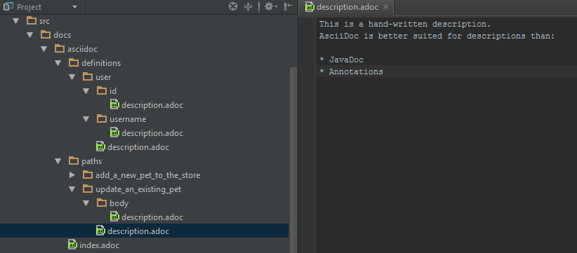
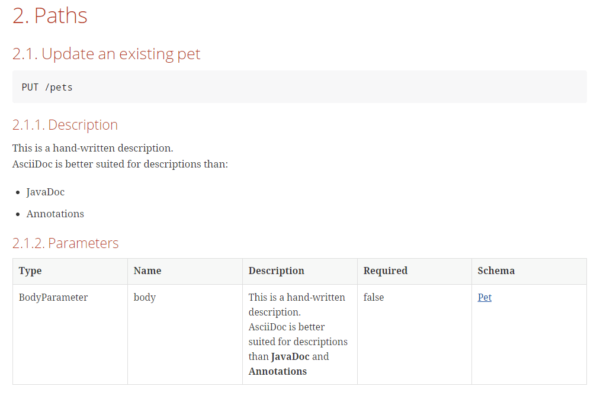

= Swagger2Markup
:author: Robert Winkler
:version: 0.6.3
:hardbreaks:

image:https://travis-ci.org/RobWin/swagger2markup.svg?branch=master["Build Status", link="https://travis-ci.org/RobWin/swagger2markup"] image:https://coveralls.io/repos/RobWin/swagger2markup/badge.svg["Coverage Status", link="https://coveralls.io/r/RobWin/swagger2markup"] image:https://api.bintray.com/packages/robwin/maven/swagger2markup/images/download.svg[link="https://bintray.com/robwin/maven/swagger2markup/_latestVersion"] image:http://img.shields.io/badge/license-ASF2-blue.svg["Apache License 2", link="http://www.apache.org/licenses/LICENSE-2.0.txt"] image:https://img.shields.io/badge/Twitter-rbrtwnklr-blue.svg["Twitter", link="https://twitter.com/rbrtwnklr"] image:https://badges.gitter.im/Join%20Chat.svg[link="https://gitter.im/RobWin/swagger2markup?utm_source=badge&utm_medium=badge&utm_campaign=pr-badge&utm_content=badge"]

== Overview

The primary goal of this project is to *simplify the generation of an up-to-date RESTful API documentation by combining documentation that's been hand-written with auto-generated API documentation* produced by https://github.com/swagger-api[Swagger]. The result is intended to be an *up-to-date, easy-to-read, on- and offline user guide*, comparable to https://developer.github.com/v3/[GitHub's API documentation]. The output of Swagger2Markup can be used as an alternative to https://github.com/swagger-api/swagger-ui[swagger-ui] and can be served as static content.

Swagger2Markup converts a Swagger JSON or YAML file into several *AsciiDoc* or *GitHub Flavored Markdown* documents which can be combined with hand-written documentation. The Swagger source file can be located locally or remotely via HTTP. Swagger2Markup supports the Swagger 1.2 and 2.0 specification. Internally it uses the _official_ https://github.com/swagger-api/swagger-parser[swagger-parser] and my https://github.com/RobWin/markup-document-builder[markup-document-builder]. 

You can use Swagger2Markup to convert your contract-first Swagger YAML file into a human-readable format and combine it with hand-written documentation. As an alternative, you can choose the code-first approach and use Swagger2Markup together with https://github.com/swagger-api/swagger-core/tree/master/samples/java-jersey2[Swagger JAX-RS], https://github.com/springfox/springfox[springfox] or https://github.com/spring-projects/spring-restdocs[spring-restdocs]. See https://github.com/RobWin/swagger2markup#usage-guide[usage guide] below. If you are are Gradle user, you can also use the https://github.com/RobWin/swagger2markup-gradle-plugin[Swagger2Markup Gradle Plugin].

http://asciidoctor.org/docs/asciidoc-writers-guide/[AsciiDoc] is preferable to Markdown as it has more features. AsciiDoc is a text document format for writing documentation, articles, books, ebooks, slideshows, web pages and blogs. AsciiDoc files can be converted to *HTML*, *PDF* and *EPUB*. AsciiDoc is much better suited for describing public APIs than *JavaDoc* or *Annotations*.

You can generate your HTML5, PDF and EPUB documentation via https://github.com/asciidoctor/asciidoctorj[asciidoctorj] or even better via the https://github.com/asciidoctor/asciidoctor-gradle-plugin[asciidoctor-gradle-plugin] or https://github.com/asciidoctor/asciidoctor-maven-plugin[asciidoctor-maven-plugin]. You can also use https://github.com/jbake-org/jbake[JBake], https://github.com/tomchristie/mkdocs[MkDocs], https://github.com/rtfd/readthedocs.org[ReadTheDocs] or https://github.com/tripit/slate[slate] to publish your AsciiDoc or Markdown documentation.

The project requires at least JDK 7.

== Usage guide

=== Adding Swagger2Markup to your project
The project is published in JCenter and Maven Central.

==== Maven

[source,xml]
----
<repositories>
    <repository>
        <snapshots>
            <enabled>false</enabled>
        </snapshots>
        <id>central</id>
        <name>bintray</name>
        <url>http://jcenter.bintray.com</url>
    </repository>
</repositories>

<dependency>
    <groupId>io.github.robwin</groupId>
    <artifactId>swagger2markup</artifactId>
    <version>0.6.3</version>
</dependency>
----

==== Gradle

[source,groovy]
----
repositories {
    jcenter()
}

compile "io.github.robwin:swagger2markup:0.6.3"
----

=== Using Swagger2Markup

Using the Swagger2MarkupConverter is simple. For example, if you are using https://github.com/spring-projects/spring-boot[Spring Boot] and https://github.com/springfox/springfox[springfox], you can generate your Swagger JSON file during the integration or unit test phase, convert the Swagger JSON file into AsciiDoc, convert AsciiDoc into HTML and PDF, copy the documentation into the Jar file and serve it as static content. That way there is no runtime overhead and there are no additional runtime libraries required.
The quickest way to get started is to look at the demo project https://github.com/RobWin/spring-swagger2markup-demo[spring-swagger2markup-demo]. The demo shows how to generate static docs (HTML5 and PDF) with the https://github.com/RobWin/swagger2markup-gradle-plugin[Swagger2Markup Gradle Plugin] and serve them as static content in a Spring Boot App under http://localhost:9080/docs/index.html and http://localhost:9080/docs/index.pdf.

==== Generate Markup during an integration test

Swagger2MarkupConverter can be used to make a request to a Swagger endpoint during an integration test. The Swagger2MarkupConverter writes the generated documents into the folder `src/docs/asciidoc/generated` or `src/docs/markdown/generated`.

[source,java]
----
@RunWith(SpringJUnit4ClassRunner.class)
@SpringApplicationConfiguration(classes = Application.class)
@IntegrationTest
@WebAppConfiguration
public class Swagger2MarkupTest {

    @Test
    public void convertRemoteSwaggerToAsciiDoc() {
        // Remote Swagger source
        // Default is AsciiDoc
        Swagger2MarkupConverter.from("http://localhost:8080/v2/api-docs").build()
            .intoFolder("src/docs/asciidoc/generated");
            
        // Then validate that three AsciiDoc files have been created
        String[] files = new File("src/docs/asciidoc/generated").list();
        assertThat(files).hasSize(3)
            .containsAll(Arrays.asList("definitions.adoc", "overview.adoc", "paths.adoc"));
    }

    @Test
    public void convertRemoteSwaggerToMarkdown() {
        // Remote Swagger source
        // Markdown
        Swagger2MarkupConverter.from("http://localhost:8080/v2/api-docs")
            .withMarkupLanguage(MarkupLanguage.MARKDOWN).build()
            .intoFolder("src/docs/markdown/generated");
            
        // Then validate that three Markdown files have been created
        String[] files = new File("src/docs/markdown/generated").list();
        assertThat(files).hasSize(3)
            .containsAll(Arrays.asList("definitions.md", "overview.md", "paths.md"));
    }

    @Test
    public void convertLocalSwaggerToAsciiDoc() {
        //Local Swagger source
        //Default is AsciiDoc
        String location = Swagger2MarkupTest.class.getResource("/json/swagger.json").getPath();
        Swagger2MarkupConverter.from(location).build()
            .intoFolder("src/docs/asciidoc/generated");
    }
}
----

==== Generate Markup during an unit test with springfox-staticdocs

Spring's MVC Test framework can also be used to make a request to a https://github.com/springfox/springfox[springfox] Swagger endpoint during an unit test. A custom ResultHandler `Swagger2MarkupResultHandler` is used to automatically convert the Swagger JSON response into an AsciiDoc document. The custom ResultHandler is part of `springfox-staticdocs`. That way you also verify that your Swagger endpoint is working.

[source,java]
----
@WebAppConfiguration
@RunWith(SpringJUnit4ClassRunner.class)
@ContextConfiguration(classes = Application.class, loader = SpringApplicationContextLoader.class)
public class Swagger2MarkupTest {

    @Autowired
    private WebApplicationContext context;

    private MockMvc mockMvc;

    @Before
    public void setUp() {
        this.mockMvc = MockMvcBuilders.webAppContextSetup(this.context).build();
    }

    @Test
    public void convertSwaggerToAsciiDoc() throws Exception {
        this.mockMvc.perform(get("/v2/api-docs")
                .accept(MediaType.APPLICATION_JSON))
                .andDo(Swagger2MarkupResultHandler.outputDirectory("src/docs/asciidoc/generated").build())
                .andExpect(status().isOk());
    }

    @Test
    public void convertSwaggerToMarkdown() throws Exception {
        this.mockMvc.perform(get("/v2/api-docs")
                .accept(MediaType.APPLICATION_JSON))
                .andDo(Swagger2MarkupResultHandler.outputDirectory("src/docs/markdown/generated")
                    .withMarkupLanguage(MarkupLanguage.MARKDOWN).build())
                .andExpect(status().isOk());
    }
}
----

==== Gradle dependencies

[source,groovy]
----
dependencies {
    ...
    compile 'io.springfox:springfox-swagger2:2.0.0'
    testCompile 'io.springfox:springfox-staticdocs:2.0.0'
    ...
}
----

==== Springfox configuration

The following is a complete https://github.com/springfox/springfox[springfox] configuration to use Swagger in a Spring Boot Application.

[source,java]
----
@SpringBootApplication
@EnableSwagger2
public class Application {

    public static void main(String[] args) {
        SpringApplication.run(Application.class, args);
    }

    @Bean
    public Docket restApi() {
        return new Docket(DocumentationType.SWAGGER_2)
                .apiInfo(apiInfo())
                .select()
                .paths(ant("/api/**"))
                .build();
    }

    private ApiInfo apiInfo() {
        return new ApiInfoBuilder()
                .title("Petstore API Title")
                .description("Petstore API Description")
                .contact("Petstore API Contact Email")
                .version("1.0.0")
                .build();
    }
}
----

==== Combine generated documentation with your hand-written documentation

The following shows how you can combine the generated documentation with your hand-written AsciiDoc documentation. You have to create an `index.adoc` (it must not be necessarily called index). To include the programmatically generated snippets in your documentation, you use Asciidoc's `include` macro. The `generated` variable is configured below.

image::images/generated_docs.PNG[generated_docs]

You can generate your HTML5 and PDF documentation via the https://github.com/asciidoctor/asciidoctor-gradle-plugin[asciidoctor-gradle-plugin] or https://github.com/asciidoctor/asciidoctor-maven-plugin[asciidoctor-maven-plugin]. The following listing shows how to configure the Asciidoctor Gradle plugin. By default it searches for AsciiDoc files in `src/docs/asciidoc` and puts the HTML and PDF output into `build/asciidoc/html5` and `build/asciidoc/pdf`. The `generated` attribute is used to replace the variable in the `index.adoc` file and to provide configurable access to the generated snippets. 

[source,groovy]
----
ext {
    generatedDocumentation = file('src/docs/asciidoc/generated')
}

test {
    outputs.dir generatedDocumentation
}

asciidoctor {
    dependsOn test
    sources {
        include 'index.adoc'
    }
    backends = ['html5', 'pdf']
    attributes = [
            doctype: 'book',
            toc: 'left',
            toclevels: '2',
            numbered: '',
            sectlinks: '',
            sectanchors: '',
            generated: generatedDocumentation
    ]
}
----

You can copy the output into your Jar file and serve the documentation as static content under `http://localhost:9080/docs/index.html` and `http://localhost:9080/docs/index.pdf`.

[source,groovy]
----
jar {
    dependsOn asciidoctor
    from ("${asciidoctor.outputDir}/html5") {
        into 'static/docs'
    }
    from ("${asciidoctor.outputDir}/pdf") {
        into 'static/docs'
    }
}
----

==== Include spring-restdocs example snippets

Swagger2Markup can be used together with https://github.com/spring-projects/spring-restdocs[spring-restdocs]. Swagger2Markup can include the generated CURL request, HTTP request and HTTP response example snippets from spring-restdocs into the generated AsciiDoc document. See https://github.com/spring-projects/spring-restdocs[spring-restdocs] how to configure it. Currently spring-restdocs does only support AsciiDoc.

Let's say you have a Swagger-annotated Spring RestController method with an ApiOperation value: `Add a new pet to the store`

[source,java]
----
@RequestMapping(method = POST)
@ApiOperation(value = "Add a new pet to the store")
@ApiResponses(value = {@ApiResponse(code = 405, message = "Invalid input")})
public ResponseEntity<String> addPet(
      @ApiParam(value = "Pet object that needs to be added to the store", required = true) @RequestBody Pet pet) {
    petData.add(pet);
    return Responses.ok("SUCCESS");
}
----

By convention the target folder of the generated request and response example files must be similar to the value of the ApiOperation, but with underscores and lowercase. For example a folder for `@ApiOperation(value = "Add a new pet to the store")` must be called `add_a_new_pet_to_the_store`.

[source,java]
----
@Test
public void findPetById() throws Exception {
    this.mockMvc.perform(post("/api/pet/").content(createPet())
            .contentType(MediaType.APPLICATION_JSON))
            .andDo(RestDocumentation.document("add_a_new_pet_to_the_store"))
            .andExpect(status().isOk());
}
----

The system property `org.springframework.restdocs.outputDir` is used to control the output base directory where the folder `add_a_new_pet_to_the_store` and the generated snippets are written to. The spring-restdocs output base directory is configured as follows:

[source,groovy]
----
ext {
    generatedDocumentation = file('src/docs/asciidoc/generated')
}

test {
    systemProperty 'org.springframework.restdocs.outputDir', generatedDocumentation
    outputs.dir generatedDocumentation
}
----

You must specify the base output directory of spring-restdocs with the builder method `withExamples("src/docs/asciidoc/generated")`.

[source,java]
----
@Test
public void convertToAsciiDoc() throws Exception {
    this.mockMvc.perform(get("/v2/api-docs")
            .accept(MediaType.APPLICATION_JSON))
            .andDo(Swagger2MarkupResultHandler.outputDirectory("src/docs/asciidoc")
                    .withExamples("src/docs/asciidoc/generated").build())
            .andExpect(status().isOk());
}
----

By convention the Swagger2MarkupConverter searches for a method annotated with `@ApiOperation(value = "Add a new pet to the store")` in a folder called `src/docs/asciidoc/generated/add_a_new_pet_to_the_store` and includes the `http-request.adoc` and `http-response.adoc` files, if they are available.

The AsciiDoc HTML output would look as follows:

image::images/springrestdocs_examples.PNG[springrestdocs]

==== Create separated definition files

If you want to create, in addition to the definitions.adoc, separate definition files for each model (ex: person.adoc, address.adoc, purchase.adoc ...), you can do the following:

[source, java]
----
Swagger2MarkupConverter.from("http://localhost:8080/v2/api-docs").withSeparatedDefinitions().build()
            .intoFolder("src/docs/asciidoc/generated");

// Then validate that separated definition files have been created
assertThat(directories).hasSize(8).containsAll(
            asList("definitions.adoc", "overview.adoc", "paths.adoc",
                "user.adoc", "category.adoc", "pet.adoc", "tag.adoc", "order.adoc"));
----

==== Include hand-written descriptions into the generated documentation

If you don't want to pollute your source code with Swagger annotations just to add descriptions to Operations, Parameters and Model definitions. Like here:

[source, java]
----
@RequestMapping(method = PUT)
@ApiOperation(value = "Update an existing pet")
@ApiResponses(value = {@ApiResponse(code = 400, message = "Invalid ID supplied"),
      @ApiResponse(code = 404, message = "Pet not found"),
      @ApiResponse(code = 405, message = "Validation exception")})
public ResponseEntity<String> updatePet(
      @ApiParam(value = "Pet object that needs to be added to the store", required = true) @RequestBody Pet pet) {
    petData.add(pet);
    return Responses.ok("SUCCESS");
}
----

You can create hand-written descriptions and include them with the builder method `withDescriptions()` into your documentation by specifying the base folder of your documentation.

[source, java]
----
Swagger2MarkupConverter.from("http://localhost:8080/v2/api-docs").withDescriptions("src/docs/asciidoc").build()
            .intoFolder("src/docs/asciidoc");
----

By convention you need two folders `paths` and `definitions` inside your description base folder.
The `paths` folder contains sub folders for all operations. The folder must be named similar to the value of the ApiOperation annotation, but with underscores and lowercase.
For example a folder for `@ApiOperation(value = "Update an existing pet")` must be called `update_an_existing_pet`.

The `definitions` folder contains sub folders for all models. The folder must be named similar to the name of the Model, but lowercase.
For example a folder for a model called `User` must be called `user`.

You can have a global description file for each operation or model. And you can have one description file per operation parameter or model property.
For example:

The AsciiDoc HTML output would look as follows:

==== Include JSON and XML Schema files.
Swagger2Markup can also include JSON and XML Schema files into the generated document.

[source,java]
----
Swagger2MarkupConverter.from("http://localhost:8080/v2/api-docs").withSchemas("src/docs/schemas").build()
                .intoFolder("src/docs/asciidoc");
----

You can create the schema files during a unit test as follows:

[source,java]
----
RestDocumented restDocumented = RestDocumented.fromProperties();
restDocumented.documentJsonSchema(MailStorageQuota.class, "src/docs/schemas");
restDocumented.documentXmlSchema(MailStorageQuota.class, "src/docs/schemas");
----

I will make RestDocumented public soon. RestDocumented creates a MailStorageQuota.xsd and MailStorageQuota.json file in the folder `src/docs/schemas`. The Swagger2MarkupConverter will include the JSON and XML Schemas, if a Swagger Operation uses the MailStorageQuota class as input or output.

== Screenshots

=== Swagger source
image::images/swagger_json.PNG[swagger_json]

=== Generated AsciiDoc
image::images/asciidoc.PNG[asciidoc]

=== Generated Markdown
image::images/markdown.PNG[markdown]

=== Generated HTML using AsciidoctorJ
image::images/asciidoc_html.PNG[asciidoc_html]

=== Generated PDF using AsciidoctorJ
image::images/asciidoc_pdf.PNG[asciidoc_pdf]

== License

Copyright 2015 Robert Winkler

Licensed under the Apache License, Version 2.0 (the "License"); you may not use this file except in compliance with the License. You may obtain a copy of the License at

    http://www.apache.org/licenses/LICENSE-2.0

Unless required by applicable law or agreed to in writing, software distributed under the License is distributed on an "AS IS" BASIS, WITHOUT WARRANTIES OR CONDITIONS OF ANY KIND, either express or implied. See the License for the specific language governing permissions and limitations under the License.

== Community contributions

* New feature RobWin/Swagger2Markup#19: In addition to the definitions.adoc you can also generate separate files for each definition model (ex: person.adoc, address.adoc, purchase.adoc)