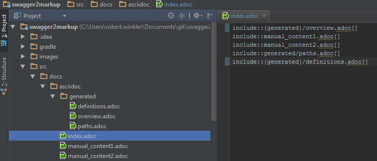
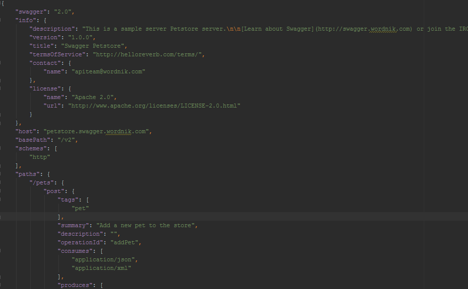
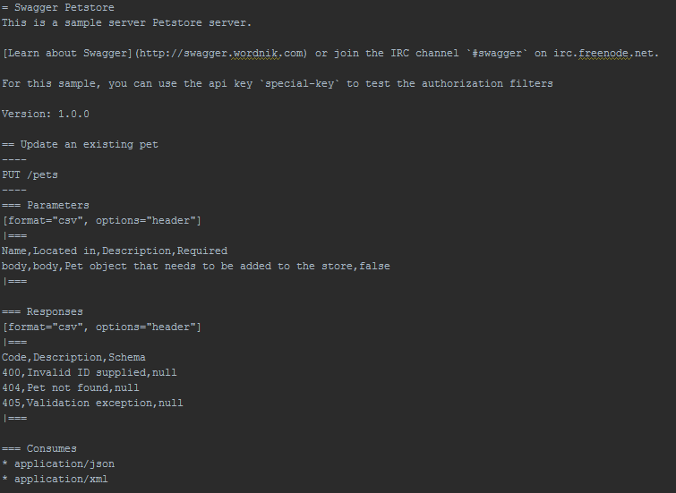
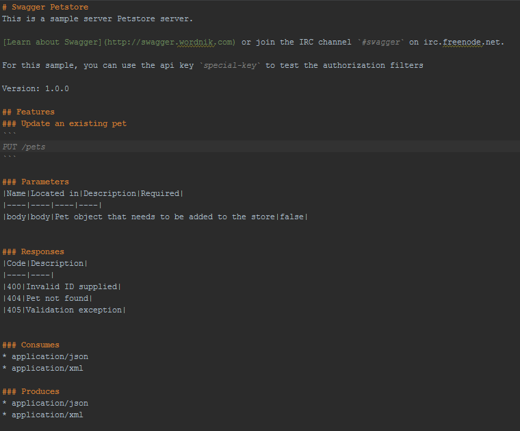
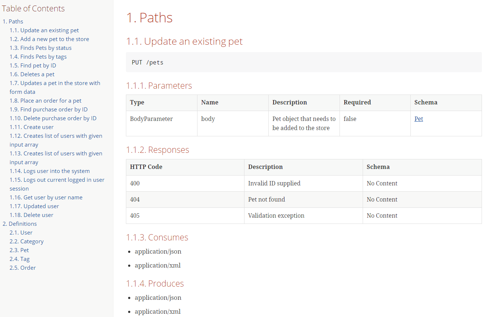
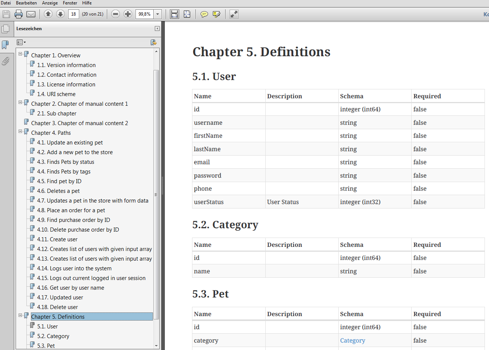
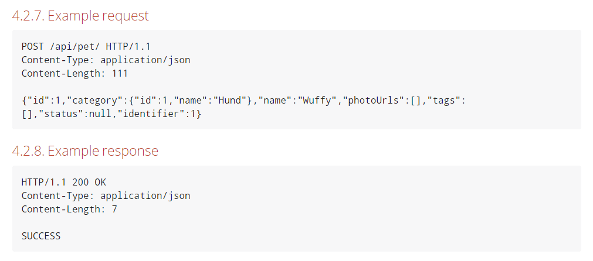

= Swagger2Markup
:author: Robert Winkler
:version: 0.5.0
:hardbreaks:

image:https://travis-ci.org/RobWin/swagger2markup.svg["Build Status", link="https://travis-ci.org/RobWin/swagger2markup"] image:https://coveralls.io/repos/RobWin/swagger2markup/badge.svg["Coverage Status", link="https://coveralls.io/r/RobWin/swagger2markup"] image:https://api.bintray.com/packages/robwin/maven/swagger2markup/images/download.svg[link="https://bintray.com/robwin/maven/swagger2markup/_latestVersion"] image:http://img.shields.io/badge/license-ASF2-blue.svg["Apache License 2", link="http://www.apache.org/licenses/LICENSE-2.0.txt"]
image:https://badges.gitter.im/Join%20Chat.svg[link="https://gitter.im/RobWin/swagger2markup?utm_source=badge&utm_medium=badge&utm_campaign=pr-badge&utm_content=badge"]

== Overview

The primary goal of this project is to simplify the documentation of a RESTful API by combining documentation that's been hand-written with auto-generated API documentation produced by https://github.com/swagger-api[Swagger]. The result is intended to be an easy-to-read, on- and offline user guide, comparable to https://developer.github.com/v3/[GitHub's API documentation]. The output of Swagger2Markup can be used as an alternative to https://github.com/swagger-api/swagger-ui[swagger-ui].

Swagger2Markup is a Swagger to Markup (AsciiDoc and GitHub Flavored Markdown) converter. The *Swagger2MarkupConverter* converts a swagger.json or swagger.yaml file into three AsciiDoc or GFM documents (Overview, Paths and Definitions) which can be combined with hand-written documentation. The Swagger source file can be located locally or remotely via HTTP. The Swagger2MarkupConverter supports the Swagger 1.2 and 2.0 specification. Internally it uses the _official_ https://github.com/swagger-api/swagger-parser[swagger-parser] and my https://github.com/RobWin/markup-document-builder[markup-document-builder]. 

You can use Swagger2Markup to convert your design-first Swagger YAML file into a human-readable format and combine it with hand-written documentation. As an alternative, you can choose the implementation-first approach and use Swagger2Markup together with https://github.com/swagger-api/swagger-core/tree/master/samples/java-jersey2[Swagger JAX-RS], https://github.com/springfox/springfox[springfox] or https://github.com/spring-projects/spring-restdocs[spring-restdocs]. See usage guide below and <<integration-with-spring-restdocs, Integration with spring-restdocs>>.

http://asciidoctor.org/docs/asciidoc-writers-guide/[AsciiDoc] is a text document format for writing documentation, articles, books, ebooks, slideshows, web pages and blogs. AsciiDoc files can be converted to many formats including HTML, PDF and EPUB. You write an AsciiDoc document the same way you would write a normal text document.

You can generate your HTML5 and PDF documentation via https://github.com/asciidoctor/asciidoctorj[asciidoctorj] or even better via the https://github.com/asciidoctor/asciidoctor-gradle-plugin[asciidoctor-gradle-plugin] or https://github.com/aalmiray/markdown-gradle-plugin[markdown-gradle-plugin]. You can also use https://github.com/jbake-org/jbake[JBake], https://github.com/tomchristie/mkdocs[MkDocs], https://github.com/rtfd/readthedocs.org[ReadTheDocs] or https://github.com/tripit/slate[slate] to publish your AsciiDoc or Markdown documentation.

The project requires at least JDK 7.

== Usage

=== Adding Swagger2Markup to your project
The project is published in JCenter and Maven Central.

==== Maven

[source,xml]
----
<repositories>
    <repository>
        <snapshots>
            <enabled>false</enabled>
        </snapshots>
        <id>central</id>
        <name>bintray</name>
        <url>http://jcenter.bintray.com</url>
    </repository>
</repositories>

<dependency>
    <groupId>io.github.robwin</groupId>
    <artifactId>swagger2markup</artifactId>
    <version>0.5.0</version>
</dependency>
----

==== Gradle

[source,groovy]
----
repositories {
    jcenter()
}

compile "io.github.robwin:swagger2markup:0.5.0"
----

=== Using Swagger2Markup

Using the Swagger2MarkupConverter is simple. For example, you can generate your AsciiDoc or Markdown documentation using https://github.com/spring-projects/spring-boot[Spring Boot] and https://github.com/springfox/springfox[springfox] during the unit or integration test phase, copy the documentation into the Jar file and serve it as static content.
The quickest way to get started is to look at the demo project https://github.com/RobWin/spring-swagger2markup-demo[spring-swagger2markup-demo]. The demo shows how to generate static docs (HTML5 and PDF) with Swagger2Markup and serve them as static content in a Spring Boot App under http://localhost:9080/docs/index.html and http://localhost:9080/docs/index.pdf.

==== Generate Markup during an integration test

Swagger2MarkupConverter can be used to make a request to a Swagger endpoint during an integration test. The Swagger2MarkupConverter writes the generated documents into the folder `src/docs/asciidoc` or `src/docs/markdown`.

[source,java]
----
@RunWith(SpringJUnit4ClassRunner.class)
@SpringApplicationConfiguration(classes = Application.class)
@IntegrationTest
@WebAppConfiguration
public class Swagger2MarkupTest {

    @Test
    public void convertRemoteSwaggerToAsciiDoc() {
        //Remote Swagger source
        //Default is AsciiDoc
        Swagger2MarkupConverter.from("http://localhost:8080/v2/api-docs").build()
            .intoFolder("src/docs/asciidoc");
    }

    @Test
    public void convertRemoteSwaggerToMarkdown() {
        //Remote Swagger source
        //Markdown
        Swagger2MarkupConverter.from("http://localhost:8080/v2/api-docs")
            .withMarkupLanguage(MarkupLanguage.MARKDOWN).build()
            .intoFolder("src/docs/markdown");
    }

    @Test
    public void convertLocalSwaggerToAsciiDoc() {
        //Local Swagger source
        //Default is AsciiDoc
        File file = new File(Swagger2MarkupTest.class.getResource("/json/swagger.json").getFile());
        Swagger2MarkupConverter.from(file.getAbsolutePath()).build()
            .intoFolder("src/docs/asciidoc");
    }
}
----

==== Generate Markup during an unit test

Spring's MVC Test framework can also be used to make a request to a https://github.com/springfox/springfox[springfox] Swagger endpoint during an unit test. A custom ResultHandler `Swagger2MarkupResultHandler` is used to automatically convert the Swagger JSON response into an AsciiDoc document. The custom ResultHandler is part of `springfox-staticdocs` now. That way you also verify that your Swagger endpoint is working.

[source,java]
----
@WebAppConfiguration
@RunWith(SpringJUnit4ClassRunner.class)
@ContextConfiguration(classes = Application.class, loader = SpringApplicationContextLoader.class)
public class Swagger2MarkupTest {

    @Autowired
    private WebApplicationContext context;

    private MockMvc mockMvc;

    @Before
    public void setUp() {
        this.mockMvc = MockMvcBuilders.webAppContextSetup(this.context).build();
    }

    @Test
    public void convertSwaggerToAsciiDoc() throws Exception {
        this.mockMvc.perform(get("/v2/api-docs")
                .accept(MediaType.APPLICATION_JSON))
                .andDo(Swagger2MarkupResultHandler.outputDirectory("src/docs/asciidoc").build())
                .andExpect(status().isOk());
    }

    @Test
    public void convertSwaggerToMarkdown() throws Exception {
        this.mockMvc.perform(get("/v2/api-docs")
                .accept(MediaType.APPLICATION_JSON))
                .andDo(Swagger2MarkupResultHandler.outputDirectory("src/docs/asciidoc")
                    .withMarkupLanguage(MarkupLanguage.MARKDOWN).build())
                .andExpect(status().isOk());
    }
}
----

==== Springfox configuration

The following is a complete https://github.com/springfox/springfox[springfox] configuration to use Swagger in a Spring Boot Application.

[source,java]
----
@SpringBootApplication
@EnableSwagger2
public class Application {

    public static void main(String[] args) {
        SpringApplication.run(Application.class, args);
    }

    @Bean
    public Docket restApi() {
        return new Docket(DocumentationType.SWAGGER_2)
                .apiInfo(apiInfo())
                .select()
                .paths(ant("/api/**"))
                .build();
    }

    private ApiInfo apiInfo() {
        return new ApiInfoBuilder()
                .title("Petstore API Title")
                .description("Petstore API Description")
                .contact("Petstore API Contact Email")
                .version("1.0.0")
                .build();
    }
}
----

==== Combine generated documentation with your hand-written documentation

The following shows how you can combine the generated documentation with your hand-written documentation with AsciiDoc. You have to create an `index.adoc` (it must not be necessarily called index). To include the programmatically generated snippets in your documentation, you use Asciidoc's `include` macro. The `generated` variable is configured below.

You can generate your HTML5 and PDF documentation via the https://github.com/asciidoctor/asciidoctor-gradle-plugin[asciidoctor-gradle-plugin]. The following listing shows how to configure the Asciidoctor Gradle plugin. By default it searches for AsciiDoc files in `src/docs/asciidoc` and puts the HTML and PDF output into `build/asciidoc/html5` and `build/asciidoc/pdf`. The `generated` attribute is used to provide configurable access to the generated snippets. The system property is used to control the base directory to which the documents are generated.

[source]
----
ext {
    generatedDocumentation = file('src/docs/asciidoc/generated')
}

test {
    systemProperty 'io.springfox.staticdocs.outputDir', generatedDocumentation
    outputs.dir generatedDocumentation
}

asciidoctor {
    dependsOn test
    sources {
        include 'index.adoc'
    }
    backends = ['html5', 'pdf']
    attributes = [
            doctype: 'book',
            toc: 'left',
            toclevels: '2',
            numbered: '',
            sectlinks: '',
            sectanchors: '',
            generated: generatedDocumentation
    ]
}
----

You can copy the output into your Jar file and serve the documentation as static content under `http://localhost:9080/docs/index.html` and `http://localhost:9080/docs/index.pdf`.

[source]
----
jar {
    dependsOn asciidoctor
    from ("${asciidoctor.outputDir}/html5") {
        into 'static/docs'
    }
    from ("${asciidoctor.outputDir}/pdf") {
        into 'static/docs'
    }
}
----

== Examples
== Swagger source

=== Generated AsciiDoc

=== Generated Markdown

=== Generated HTML using AsciidoctorJ

=== Generated PDF using AsciidoctorJ

== Integration with spring-restdocs
Swagger2Markup can be used together with https://github.com/spring-projects/spring-restdocs[spring-restdocs]. Swagger2Markup can include the generated HTTP request and response snippets from spring-restdocs into the generated AsciiDoc document. See https://github.com/spring-projects/spring-restdocs[spring-restdocs] how to configure it.
Currently spring-restdocs does only support AsciiDoc.

Let's say you have a Swagger-annotated Spring RestController method with an ApiOperation value: `Add a new pet to the store`

[source,java]
----
@RequestMapping(method = POST)
@ApiOperation(value = "Add a new pet to the store")
@ApiResponses(value = {@ApiResponse(code = 405, message = "Invalid input")})
public ResponseEntity<String> addPet(
      @ApiParam(value = "Pet object that needs to be added to the store", required = true) @RequestBody Pet pet) {
    petData.add(pet);
    return Responses.ok("SUCCESS");
}
----

The target folder of the generated request and response example files must be `add_a_new_pet_to_the_store` (similar to the value of the ApiOperation, but with underscores and lowercase).

[source,java]
----
@Test
public void findPetById() throws Exception {
    this.mockMvc.perform(post("/api/pet/").content(createPet())
            .contentType(MediaType.APPLICATION_JSON))
            .andDo(RestDocumentation.document("add_a_new_pet_to_the_store"))
            .andExpect(status().isOk());
}
----

The spring-restdocs output directory is configured as follows:

[source]
----
org.springframework.restdocs.outputDir = src/docs/asciidoc/generated
----

You must specify the base output directory of spring-restdocs with the builder method `withExamples("src/docs/asciidoc/generated")`.

[source,java]
----
@Test
public void convertToAsciiDoc() throws Exception {
    this.mockMvc.perform(get("/v2/api-docs")
            .accept(MediaType.APPLICATION_JSON))
            .andDo(Swagger2MarkupResultHandler.outputDirectory("swagger_adoc")
                    .withExamples("src/docs/asciidoc/generated").build())
            .andExpect(status().isOk());
}
----

The Swagger2MarkupConverter searches for a Swagger ApiOperation with value `Add a new pet to the store` in a folder called `src/docs/asciidoc/generated/add_a_new_pet_to_the_store` and includes the `http-request.adoc` and `http-response.adoc` files, if they are available.

=== Generated AsciiDoc

== Integration of JSON and XML Schema files.
Swagger2Markup can also include JSON and XML Schema files into the generated document.

[source,java]
----
Swagger2MarkupConverter.from("http://localhost:8080/api-docs").withSchemas("src/docs/schemas").build()
                .intoFolder("src/docs/asciidoc");
----

You can create the schema files during a unit test as follows:

[source,java]
----
RestDocumented restDocumented = RestDocumented.fromProperties();
restDocumented.documentJsonSchema(MailStorageQuota.class, "src/docs/schemas");
restDocumented.documentXmlSchema(MailStorageQuota.class, "src/docs/schemas");
----

I will make RestDocumented public soon. RestDocumented creates a MailStorageQuota.xsd and MailStorageQuota.json file in the folder `src/docs/schemas`. The Swagger2MarkupConverter will include the JSON and XML Schemas, if a Swagger Operation uses the MailStorageQuota class as input or output.

== License

Copyright 2015 Robert Winkler

Licensed under the Apache License, Version 2.0 (the "License");
you may not use this file except in compliance with the License.
You may obtain a copy of the License at

    http://www.apache.org/licenses/LICENSE-2.0

Unless required by applicable law or agreed to in writing, software
distributed under the License is distributed on an "AS IS" BASIS,
WITHOUT WARRANTIES OR CONDITIONS OF ANY KIND, either express or implied.
See the License for the specific language governing permissions and
limitations under the License.
