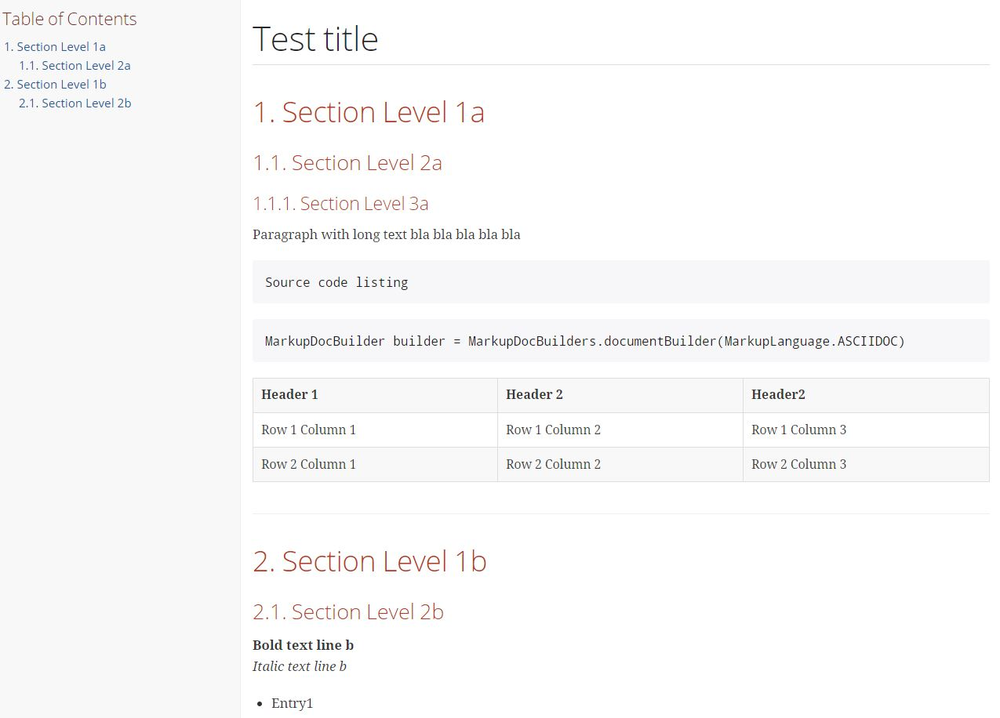

= MarkupDocBuilder
:author: Robert Winkler
:version: 0.1.0
:hardbreaks:

image:https://travis-ci.org/RobWin/markup-document-builder.svg["Build Status", link="https://travis-ci.org/RobWin/markup-document-builder"] image:https://coveralls.io/repos/RobWin/markup-document-builder/badge.svg["Coverage Status", link="https://coveralls.io/r/RobWin/markup-document-builder"] image:http://img.shields.io/:version-{version}-blue.svg["Semantic Versioning", link="https://bintray.com/robwin/maven/markup-document-builder/0.1.0/view"] image:http://img.shields.io/badge/license-ASF2-blue.svg["Apache License 2", link="http://www.apache.org/licenses/LICENSE-2.0.txt"]

== Overview

This project is a Markup document builder (AsciiDoc and Markdown). The primary goal of this project is to simplify the creation of Markup documents.

The project requires at least JDK 7.

=== Usage
The MarkupDocBuilder allows to build an AsciiDoc or Markdown document via the Builder pattern.

[source,java]
----
public class MarkupDocBuilderTest {

    List<String> tableCsvRows;

    @Before
    public void setUp(){
        tableCsvRows = new ArrayList<>();
        tableCsvRows.add("Header 1,Header 2,Header2");
        tableCsvRows.add("Row 1 Column 1,Row 1 Column 2,Row 1 Column 3");
        tableCsvRows.add("Row 2 Column 1,Row 2 Column 2,Row 2 Column 3");
    }

    @Test
    public void testToAsciiDocFile() throws IOException {
        MarkupDocBuilder builder = MarkupDocBuilders.documentBuilder(MarkupLanguage.ASCIIDOC);
        builder.documentTitle("Test title")
                .sectionTitleLevel1("Section Level 1a")
                .sectionTitleLevel2("Section Level 2a")
                .sectionTitleLevel3("Section Level 3a")
                .paragraph("Paragraph with long text bla bla bla bla bla")
                .listing("Source code listing")
                .source("MarkupDocBuilder builder = MarkupDocBuilders.documentBuilder(MarkupLanguage.ASCIIDOC)", "java")
                .tableWithHeaderRow(tableCsvRows)
                .sectionTitleLevel1("Section Level 1b")
                .sectionTitleLevel2("Section Level 2b")
                .boldTextLine("Bold text line b")
                .italicTextLine("Italic text line b")
                .unorderedList(Arrays.asList("Entry1", "Entry2", "Entry 2"))
                .writeToFile("build/tmp", "test", StandardCharsets.UTF_8);
    }

    @Test
     public void testToMarkdownDocFile() throws IOException {
        MarkupDocBuilder builder = MarkupDocBuilders.documentBuilder(MarkupLanguage.MARKDOWN);
        builder.documentTitle("Test title")
                .sectionTitleLevel1("Section Level 1a")
                .sectionTitleLevel2("Section Level 2a")
                .sectionTitleLevel3("Section Level 3a")
                .paragraph("Paragraph with long text bla bla bla bla bla")
                .listing("Source code listing")
                .source("MarkupDocBuilder builder = MarkupDocBuilders.documentBuilder(MarkupLanguage.ASCIIDOC)", "java")
                .tableWithHeaderRow(tableCsvRows)
                .sectionTitleLevel1("Section Level 1b")
                .sectionTitleLevel2("Section Level 2b")
                .boldTextLine("Bold text line b")
                .italicTextLine("Italic text line b")
                .unorderedList(Arrays.asList("Entry1", "Entry2", "Entry 2"))
                .writeToFile("build/tmp", "test", StandardCharsets.UTF_8);
    }

}
----

=== Generated HTML using AsciidoctorJ
You can generate your PDF or HTML documentation via https://github.com/asciidoctor/asciidoctorj[asciidoctorj] or even better via the https://github.com/asciidoctor/asciidoctor-gradle-plugin[asciidoctor-gradle-plugin] or https://github.com/aalmiray/markdown-gradle-plugin[markdown-gradle-plugin].

