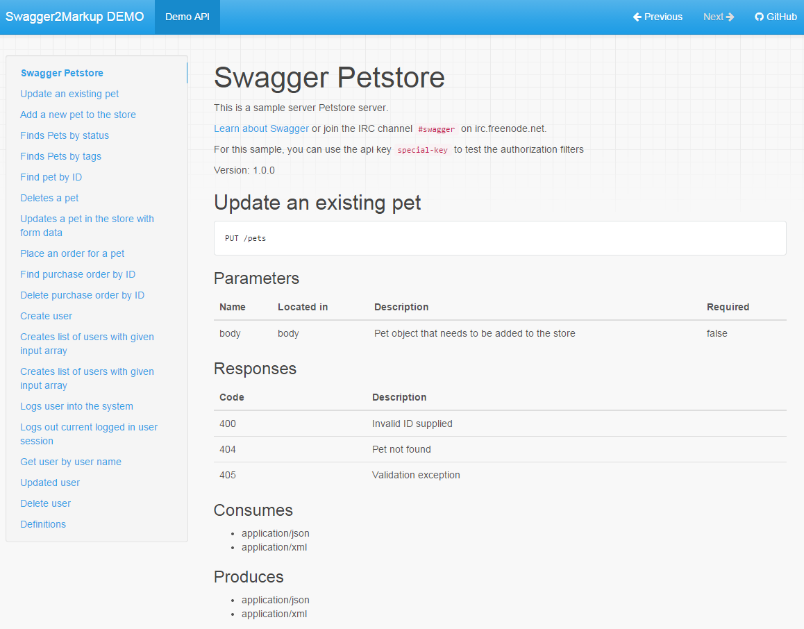

= Swagger2Markup
:author: Robert Winkler
:version: 0.2.3
:hardbreaks:

image:https://travis-ci.org/RobWin/swagger2markup.svg["Build Status", link="https://travis-ci.org/RobWin/swagger2markup"] image:https://coveralls.io/repos/RobWin/swagger2markup/badge.svg["Coverage Status", link="https://coveralls.io/r/RobWin/swagger2markup"] image:https://api.bintray.com/packages/robwin/maven/swagger2markup/images/download.svg[link="https://bintray.com/robwin/maven/swagger2markup/_latestVersion"] image:http://img.shields.io/badge/license-ASF2-blue.svg["Apache License 2", link="http://www.apache.org/licenses/LICENSE-2.0.txt"]
image:https://badges.gitter.im/Join%20Chat.svg[link="https://gitter.im/RobWin/swagger2markup?utm_source=badge&utm_medium=badge&utm_campaign=pr-badge&utm_content=badge"]

== Overview

This project is a Swagger to Markup (AsciiDoc and Markdown) converter. The *Swagger2MarkupConverter* takes a swagger.json or swagger.yaml file as source and converts it into an AsciiDoc or Markdown document. The Swagger source file can be located locally or remotely accessible via HTTP. The Swagger2MarkupConverter supports the Swagger 1.2 and 2.0 specification. Internally it uses the _official_ https://github.com/swagger-api/swagger-parser[swagger-parser] and my https://github.com/RobWin/markup-document-builder[markup-document-builder].

The primary goal of this project is to simplify the documentation of RESTful APIs. The result is intended to be an easy-to-read, on- and offline user guide, comparable to https://developer.github.com/v3/[GitHub's API documentation]. 
Swagger2Markup can be used together with https://github.com/springfox/springfox[springfox] and https://github.com/spring-projects/spring-restdocs[spring-restdocs]. See <<integration-with-spring-restdocs, Integration with spring-restdocs>>.

The project requires at least JDK 7.

== Usage

=== Adding Swagger2Markup to your project
The project is published in JCenter and Maven Central.

==== Maven

[source,xml]
----
<repositories>
    <repository>
        <snapshots>
            <enabled>false</enabled>
        </snapshots>
        <id>central</id>
        <name>bintray</name>
        <url>http://jcenter.bintray.com</url>
    </repository>
</repositories>

<dependency>
    <groupId>io.github.robwin</groupId>
    <artifactId>swagger2markup</artifactId>
    <version>0.2.3</version>
</dependency>
----

==== Gradle

[source,groovy]
----
repositories {
    jcenter()
}

compile "io.github.robwin:swagger2markup:0.2.3"
----

=== Using Swagger2Markup

Using the Swagger2MarkupConverter is simple. For instance, you can generate your AsciiDoc/Markdown documentation using https://github.com/spring-projects/spring-boot[Spring Boot] and https://github.com/martypitt/swagger-springmvc[swagger-springmvc] as follows.
See demo project https://github.com/RobWin/spring-swagger2markup-demo[spring-swagger2markup-demo].

[source,java]
----
@RunWith(SpringJUnit4ClassRunner.class)
@SpringApplicationConfiguration(classes = SpringBootSwaggerConfig.class)
@IntegrationTest
@WebAppConfiguration
public class Swagger2MarkupTest {

    @Test
    public void convertSwaggerToMarkup() {
        //Remote Swagger source
        //Markdown
        Swagger2MarkupConverter.from("http://localhost:8080/api-docs").
                withMarkupLanguage(MarkupLanguage.MARKDOWN).build()
                .intoFolder("src/docs/markdown");

        //Remote Swagger source
        //Default is AsciiDoc
        Swagger2MarkupConverter.from("http://localhost:8080/api-docs").build()
                .intoFolder("src/docs/asciidoc");

        //Local Swagger source
        //Default is AsciiDoc
        File file = new File(Swagger2MarkupTest.class.getResource("/json/swagger.json").getFile());
        Swagger2MarkupConverter.from(file.getAbsolutePath()).build()
                        .intoFolder("src/docs/asciidoc");
    }

    @Test
    public void testSwagger2HtmlConversion() throws IOException {
        File file = new File(Swagger2MarkupConverterTest.class.getResource("/json/swagger.json").getFile());
        String asciiDoc =  Swagger2MarkupConverter.from(file.getAbsolutePath()).build().asString();
        String path = "src/docs/asciidocAsString";
        Files.createDirectories(Paths.get(path));
        try (BufferedWriter writer = Files.newBufferedWriter(Paths.get(path, "swagger.adoc"), StandardCharsets.UTF_8)){
            writer.write(asciiDoc);        }
        String asciiDocAsHtml = Asciidoctor.Factory.create().convert(asciiDoc,
                OptionsBuilder.options().backend("html5").headerFooter(true).safe(SafeMode.UNSAFE).docType("book").attributes(AttributesBuilder.attributes()
                        .tableOfContents(true).tableOfContents(Placement.LEFT).sectionNumbers(true).hardbreaks(true).setAnchors(true).attribute("sectlinks")));
        try (BufferedWriter writer = Files.newBufferedWriter(Paths.get(path, "swagger.html"), StandardCharsets.UTF_8)){
            writer.write(asciiDocAsHtml);
        }
    }
}
----

[source,java]
----
@SpringBootApplication
@EnableSwagger
public class SpringBootSwaggerConfig {

    public static void main(String[] args) {
        SpringApplication.run(SpringBootTestConfig.class, args);
    }

    @Autowired
    private SpringSwaggerConfig springSwaggerConfig;

    @Bean
    public SwaggerSpringMvcPlugin customImplementation(){
        return new SwaggerSpringMvcPlugin(this.springSwaggerConfig)
                .apiInfo(apiInfo()).excludeAnnotations(Controller.class);
    }

    private ApiInfo apiInfo() {
        ApiInfo apiInfo = new ApiInfo(
                "My Apps API Title",
                "My Apps API Description",
                "My Apps API terms of service",
                "My Apps API Contact Email",
                "My Apps API Licence Type",
                "My Apps API License URL"
        );
        return apiInfo;
    }
}
----

You can generate your HTML5 and PDF documentation via https://github.com/asciidoctor/asciidoctorj[asciidoctorj] or even better via the https://github.com/asciidoctor/asciidoctor-gradle-plugin[asciidoctor-gradle-plugin] or https://github.com/aalmiray/markdown-gradle-plugin[markdown-gradle-plugin].
You can also use https://github.com/tomchristie/mkdocs[MkDocs] and https://github.com/rtfd/readthedocs.org[ReadTheDocs] to publish your Markdown documentation.
See http://spring-swagger2markup-demo.readthedocs.org/[ReadTheDocs-demo]

== Examples
== Swagger source file
image::images/swagger_json.PNG[swagger_json]

=== Generated AsciiDoc file
image::images/asciidoc.PNG[asciidoc]

=== Generated Markdown file
image::images/markdown.PNG[markdown]

=== Generated HTML using AsciidoctorJ
image::images/asciidoc_html.PNG[asciidoc_html]

=== Generated HTML using Mkdocs

=== Generated PDF using AsciidoctorJ
image::images/asciidoc_pdf.PNG[asciidoc_pdf]

== Integration with spring-restdocs
https://github.com/spring-projects/spring-restdocs[spring-restdocs] can be used together with Swagger2Markup.
Swagger2Markup can include the generated examples from spring-restdocs into the generated AsciiDoc document.
Currently it does not work for Markdown, since spring-restdocs generates only AsciiDoc files.

Let's say I have a Swagger-annotated Spring RestController method with an ApiOperation value: _"Create a quota"_

[source,java]
----
@ApiOperation(value = "Create a quota", notes =  "Create a quota allows bla bla bla bla")
public void createMailStorageQuota(@ApiParam(name = "MailStorageQuota",
    value = "MailStorageQuota", required = true) @RequestBody MailStorageQuota mailStorageQuota) {
}
----

I'm using spring-restdocs in combination with https://github.com/jayway/rest-assured to test the Controller.
The target folder of the generated request and response example files must be _"create_a_quota"_ (similar to the value of the ApiOperation).

[source,java]
----
given().contentType(ContentType.XML).body(storageQuota).resultHandlers(document("create_a_quota")).
when().put("/quotas").
then().statusCode(204);
----

The spring-restdocs output directory is configured as follows:

[source]
----
io.restdocumented.outputDir = docs/generated
----

The Swagger2MarkupConverter must know the output directory of spring-restdocs.

[source,java]
----
Swagger2MarkupConverter.from("http://localhost:8080/api-docs").
                withExamples("docs/generated").build()
                .intoFolder("src/docs/asciidoc");
----

The Swagger2MarkupConverter searches for a Swagger ApiOperation with value: _"Create a quota"_ in a folder called _"docs/generated/create_a_quota"_  and includes the _request.asciidoc_ and _response.asciidoc_ files, if they are available.

== Integration of JSON and XML Schema files.
Swagger2Markup can also include JSON and XML Schema files into the generated document.

[source,java]
----
Swagger2MarkupConverter.from("http://localhost:8080/api-docs").
                withMarkupLanguage(MarkupLanguage.MARKDOWN).
                withExamples("docs/generated").withSchemas("docs/schemas").build()
                .intoFolder("src/docs/markdown");
----

I create the Schemas files in Unit-Tests as follows:

[source,java]
----
        RestDocumented restDocumented = RestDocumented.fromProperties();
        restDocumented.documentJsonSchema(MailStorageQuota.class, "docs/schemas");
        restDocumented.documentXmlSchema(MailStorageQuota.class, "docs/schemas");
----

I will make RestDocumented public soon. RestDocumented creates a MailStorageQuota.xsd and MailStorageQuota.json file in the folder "docs/schemas".
The Swagger2MarkupConverter will include the JSON and XML Schemas, if a Swagger Operation uses the MailStorageQuota class as Input or Output.

See example: http://spring-swagger2markup-demo.readthedocs.org/en/latest/generated/definitions/[ReadTheDocs-demo]
